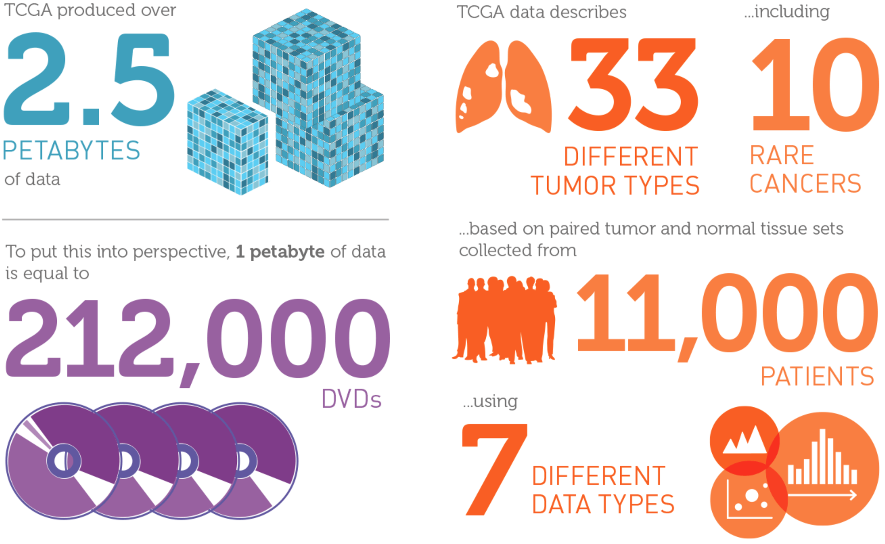

```{r xaringan-themer, include = FALSE}
library(xaringanthemer)
mono_light(
  base_color = "midnightblue",
  header_font_google = google_font("Josefin Sans"),
  text_font_google   = google_font("Montserrat", "500", "500i"),
  code_font_google   = google_font("Droid Mono"),
  link_color = "#8B1A1A", #firebrick4, "deepskyblue1"
  text_font_size = "28px",
  code_font_size = "26px"
)
library(icons)
```

## The Cancer Genome Atlas (TCGA)

- Started December 13, 2005, phase II in 2009, ended in 2014

- Mission - to accelerate our understanding of the molecular basis of cancer through the application of genome analysis technologies, including large-scale genome sequencing

- Data generation
    - Clinical information about participants
    - Metadata about the samples (e.g. the weight of a sample portion, etc.)
    - Histopathology slide images from sample portions
    - Molecular information derived from the samples (e.g. mRNA/miRNA expression, protein expression, copy number, etc.)

https://cancergenome.nih.gov

---
## TCGA by the numbers

.center[  ]

https://cancergenome.nih.gov/abouttcga

<!--
## Major TCGA Research Components

- **Biospecimen Core Resource (BCR)** - Collect and process tissue samples

- **Genome Sequencing Centers (GSCs)** - Use high-throughput Genome Sequencing to identify the changes in DNA sequences in cancer

- **Genome Characterization Centers (GCCs)** - Analyze genomic and epigenomic changes involved in cancer

- **Data Coordinating Center (DCC)** - The TCGA data are centrally managed at the DCC

- **Genome Data Analysis Centers (GDACs)** - These centers provide informatics tools to facilitate broader use of TCGA data
-->

---
## TCGA data types

.center[  ]

.small[ http://www.liuzlab.org/TCGA2STAT/DataPlatforms.pdf ]

---
## TCGA cancer types

.center[  ]

.small[ http://www.liuzlab.org/TCGA2STAT/CancerDataChecklist.pdf ]

---
## TCGA Clinical data

.center[  ]

.small[ http://www.liuzlab.org/TCGA2STAT/ClinicalVariables.pdf ]

<!--
## TCGA sample identifiers

- Each sample has a unique ID (barcode), like `TCGA-AO-A128`
- Each barcode can and should be parsed

.center[  ]

- Can be used to distinguish normal and tumor samples (Tumor types range: 01 - 09, normal types: 10 - 19, control samples: 20 - 29)
- Not to be confused with case UUIDs, like `7eea2b6e-771f-44c0-9350-38f45c8dbe87`, which are bound to filenames

.small[ https://docs.gdc.cancer.gov/Encyclopedia/pages/TCGA_Barcode/ ]
-->
<!--
## PAM50

- Breast cancer can be classified into 4 major intrinsic subtypes: Luminal A, Luminal B, Her2-enriched, Basal
- Subtypes are clinically relevant for drug sensitivity and long-term survival 
- Determine tumor subtype by looking at the gene expression of 50 genes

https://xenabrowser.net/datapages/?dataset=TCGA.BRCA.sampleMap/BRCA_clinicalMatrix&host=https://tcga.xenahubs.net

`genefu` R package for PAM50 classification and survival analysis. https://www.bioconductor.org/packages/release/bioc/html/genefu.html

.small[ Parker, Joel S., Michael Mullins, Maggie C. U. Cheang, Samuel Leung, David Voduc, Tammi Vickery, Sherri Davies, et al. “[Supervised Risk Predictor of Breast Cancer Based on Intrinsic Subtypes](https://doi.org/10.1200/JCO.2008.18.1370).” Journal of Clinical Oncology: Official Journal of the American Society of Clinical Oncology, (March 10, 2009) ]
-->

---
## Two types of TCGA Data

- **Open access** - data that cannot be tied to an individual. This tier does not require user certification for data access

- **Controlled access** - contains individually-unique data and information that could potentially be used to identify an individual. This tier requires user certification for data access
  - An access control policy is in place for TCGA data to ensure that personally identifiable information is protected from unauthorized users

---
## TCGA Controlled Access Data

Access to controlled data is available to researchers who:

- Agree to restrict their use of the data to biomedical research purposes only

- Agree with the rules outlined in the TCGA Data Use Certification (DUC)

- Have their institutions certify the TCGA DUC statements

- Complete the Data Access Request (DAR) form and submit it to the Data Access Committee to be a TCGA Approved User

https://gdc.cancer.gov/access-data/obtaining-access-controlled-data

---
## The Broad Institute Genome Data Analysis Center (GDAC) Firehose

- Standardized, analysis-ready TCGA datasets in text format
    - Aggregated, version-stamped
    - Analysis-ready format / semantics

- Standardized analyses upon them
    - Established algorithms: GISTIC, MutSig, CNMF, ...
    - Includes biologist-friendly reports

http://gdac.broadinstitute.org

---
## Firehose data access

- [fbget](https://broadinstitute.atlassian.net/wiki/spaces/GDAC/pages/844333806/fbget) - Python application programming interface (API) with >27 functions for Sample-level data, Firehose analyses, Standard data archives, Metadata access

- Unix command-line access, `firehose_get`

- [FirebrowseR](https://github.com/mariodeng/FirebrowseR) - An R package for Broad's Firehose data, providing TCGA data sets

- [web-TCGA](https://github.com/mariodeng/web-TCGA) - a shiny app to access TCGA data from Firebrowse

http://firebrowse.org

---
## R programming language

- **R** is a programming language designed for data analysis and statistics

- Extremely powerful for statistical modeling, machine learning, data manipulation and visualization

- Free, cross-platform, and open-source

https://www.r-project.org

---
## Bioconductor for data access and analysis

- **Bioconductor** - the largest repository of R packages for the analysis and visualization of high-throughput genomic data

- 2,266 omics analysis packages as of April, 2024

https://bioconductor.org


---
## R resources to access TCGA data

- `curatedTCGAData` - Curated Data From The Cancer Genome Atlas (TCGA) as MultiAssayExperiment Objects
    - MultiAssayExperiment objects integrate multiple assays (e.g. RNA-seq, copy number, mutation, microRNA, protein, and others) with clinical / pathological data
    - Patient IDs are matched (same number and order) across multiple assays, enabling harmonized subsetting of rows (features) and columns (patients / samples) across the entire experiment

- `TCGAutils` - Tools for working with `curatedTCGAData`

https://bioconductor.org/packages/curatedTCGAData/

https://bioconductor.org/packages/TCGAutils

---
## R resources to access TCGA data

- `curatedOvarianData`
    - 30 datasets, > 3K unique samples
    - survival, surgical debulking, histology...

- `curatedCRCData` (colorectal)
    - 34 datasets, ~4K unique samples
    - many annotated for MSS, gender, stage, age, N, M

- `curatedBladderData`
    - 12 datasets, ~1,200 unique samples
    - many annotated for stage, grade, OS

---
## BioC CancerData Views

.small[

| Package                     	| Maintainer               	| Title                                                                                                                     	| Rank  	|
|-----------------------------	|--------------------------	|---------------------------------------------------------------------------------------------------------------------------	|-------	|
|                             	|                          	|                                                                                                                           	|       	|
| ALL                         	| Robert   Gentleman       	| A data package                                                                                                            	| 1     	|
| GSVAdata                    	| Robert Castelo           	| Data employed   in the vignette of the GSVA package                                                                       	| 13    	|
| bladderbatch                	| Jeffrey T. Leek          	| Bladder gene   expression data illustrating batch effects                                                                 	| 14    	|
| depmap                      	| Laurent Gatto            	| Cancer   Dependency Map Data Package                                                                                      	| 15    	|
| bcellViper                  	| Mariano Javier   Alvarez 	| Human B-cell   transcriptional interactome and normal human B-cell expression data                                        	| 16    	|
| Illumina450ProbeVariants.db 	| Tiffany Morris           	| Annotation   Package combining variant data from 1000 Genomes Project for Illumina   HumanMethylation450 Bead Chip probes 	| 17    	|
| curatedTCGAData             	| Marcel Ramos             	| Curated Data   From The Cancer Genome Atlas (TCGA) as MultiAssayExperiment Objects                                        	| 21    	|

https://bioconductor.org/packages/release/BiocViews.html#___CancerData
 ]

---
## TCGA packages


.pull-left[
`TCGAbiolinks` - an R package for integrative analysis of TCGA data

.small[https://bioconductor.org/packages/TCGAbiolinks]
]

.pull-right[
.center[  ]
]

.small[ Colaprico, A. et al. **“TCGAbiolinks: An R/Bioconductor Package for Integrative Analysis of TCGA Data.”** _Nucleic Acids Research_, May 2016, https://doi.org/10.1093/nar/gkv1507 ]

<!--
## TCGA2STAT

.center[  ]

- Well-structured TCGA data access in R

https://CRAN.R-project.org/package=TCGA2STAT
-->

<!--
## GDCRNATools

- Downloading, organizing, and integrative analyzing RNA data in the GDC
- Differential gene expression analysis, ceRNAs regulatory network analysis, univariate survival analysis, and functional enrichment analysis.
- Considers ceRNAs - Competing endogenous RNAs, RNA molecules that indirectly regulate other RNA transcripts by competing for the shared miRNAs.

https://github.com/Jialab-UCR/GDCRNATools

Li, Ruidong, Han Qu, Shibo Wang, Julong Wei, Le Zhang, Renyuan Ma, Jianming Lu, Jianguo Zhu, Wei-De Zhong, and Zhenyu Jia. “GDCRNATools: An R/Bioconductor Package for Integrative Analysis of LncRNA, MiRNA, and MRNA Data in GDC,” December 11, 2017. https://doi.org/10.1101/229799.

https://github.com/Jialab-UCR/GDCRNATools
-->

---
## Survival analysis of TCGA data

- Liu, J. et al. **“An Integrated TCGA Pan-Cancer Clinical Data Resource to Drive High-Quality Survival Outcome Analytics.”** _Cell_, April 5, 2018, https://doi.org/10.1016/j.cell.2018.02.052


- Raman, P. et al. **“A Comparison of Survival Analysis Methods for Cancer Gene Expression RNA-Sequencing Data.”** _Cancer Genetics_, June 2019, https://doi.org/10.1016/j.cancergen.2019.04.004

- Zhao, Z. et al. **“Tutorial on Survival Modeling with Applications to Omics Data.”** _Bioinformatics_, March 2024, https://doi.org/10.1093/bioinformatics/btae132

https://github.com/mdozmorov/TCGAsurvival

---
## UCSC (University of California Santa Cruz) Xena

- Over 1,600 datasets from over 50 cancer types, including TCGA, ICGC, TCGA Pan-Cancer Atlas, PCAWG (Pan-Cancer Analysis of Whole Genomes) and the GDC datasets. https://xenabrowser.net
  - Open-public Xena Hubs, data download, https://xenabrowser.net/hub
  - Private Xena Hubs for user-specific data analysis

- A tool to visually explore and analyze cancer genomics data and its associated clinical information
  - Survival analysis
  - Tumor-normal expression comparison
  - Gene expression-clinical associations

.small[ Cline, M. et al. **“Exploring TCGA Pan-Cancer Data at the UCSC Cancer Genomics Browser.”** _Scientific Reports_, October 2013, https://doi.org/10.1038/srep02652 ]

<!--
## Gitools

- A framework for analysis and visualization of multidimensional genomic data using interactive heatmaps
- User-provided and precompiled datasets: TCGA, IntOGen
- Analyses: Enrichment, Group Comparison, Mutual exclusion and co-occurrence test, Correlations, Overlaps, Combination of p-values

.center[  ]

http://www.gitools.org/
-->

---
## TCGA analysis on the cloud

- Goal - simplify centralized access to TCGA data and provide easy analysis

- Three centers were awarded to develop cloud access 
    - Institute for Systems Biology Cancer Genomics Cloud (ISB-CGC)
    - Terra at Broad Institute
    - Seven Bridges Cancer Genomics Cloud

http://cgc.systemsbiology.net

https://terra.bio

http://www.cancergenomicscloud.org

---
## NCI's Genomic Data Commons (GDC)

Launched on June 6, 2016. Provides standardized genomic and clinical data.

- **[The Cancer Genome Atlas (TCGA)](https://www.cancer.gov/about-nci/organization/ccg/research/structural-genomics/tcga)**

- **[Therapeutically Applicable Research To Generate Effective Treatments (TARGET)](https://www.cancer.gov/ccg/research/genome-sequencing/target)** - A comprehensive genomic data to determine molecular changes that drive childhood cancers (AML and Neuroblastoma)

- **[Cancer Cell Line Encyclopedia (CCLE)](https://portals.broadinstitute.org/ccle)** - Genome-wide information of ~1000 cell lines. Pharmacologic response profiles and mutation status

- **[Stand Up To Cancer (SU2C)](https://standuptocancer.org/)** - 50 Breast cancer cell lines. Pharmacologic response profiles to 77 therapeutic compounds

- **[Connectivity Map](https://www.broadinstitute.org/connectivity-map-cmap)** - 4 cell lines and 1309 perturbagens at several concentrations. Gene expression change after treatment

---
## Accessing GDC
    
- The GDC Application Programming Interface (API)

- `GenomicDataCommons` - GDC access in R

https://docs.gdc.cancer.gov/API/Users_Guide/Getting_Started/#api-endpoints

https://bioconductor.org/packages/GenomicDataCommons

---
## cBioPortal

- Rich set of tools for visualization, analysis and download of large-scale cancer genomics data sets. http://www.cbioportal.org
    - Mutations (OncoPrint display)
    - Mutual exclusivity of genetic events (log-odds ratio)
    - Correlations among genetic events (boxplots)
    - Survival (Kaplan-Meier plots)

- The Onco Query Language (OQL) to fine-tune queries

https://docs.cbioportal.org/user-guide/overview - documentation, presentations, short tutorials

.small[ Gao, J. et al. **“Integrative Analysis of Complex Cancer Genomics and Clinical Profiles Using the CBioPortal.”** _Science Signaling_ April 2013, https://doi.org/10.1126/scisignal.2004088 ]

---
## cBioPortal data access

- REST-based web API
  - https://www.cbioportal.org/webAPI

- `cBioPortalData` R package providing access to the cBioPortal data
  - https://bioconductor.org/packages/cBioPortalData


<!--
## Other resources for cancer genomics

- [IntOgen](https://www.intogen.org/search) - catalog of cancer driver mutations
- [Regulome Explorer](http://explorer.cancerregulome.org/) - exploratory analysis of integrated TCGA data
- [Oncomine research edition](https://www.oncomine.org/resource/login.html) - coexpression, differential analysis of cancer datasets, including TCGA
- [CPTAC](https://proteomics.cancer.gov/programs/cptac) - Clinical Proteomics Tumor Analysis Consortium

.small[ Gonzalez-Perez, Abel, Christian Perez-Llamas, Jordi Deu-Pons, David Tamborero, Michael P Schroeder, Alba Jene-Sanz, Alberto Santos, and Nuria Lopez-Bigas. “[IntOGen-Mutations Identifies Cancer Drivers across Tumor Types](https://doi.org/10.1038/nmeth.2642).” Nature Methods, (September 15, 2013) ]
-->

<!--
## International Cancer Genome Consortium

- The International Cancer Genome Consortium (ICGC)’s Pan-Cancer Analysis of Whole Genomes (PCAWG) project aimed to categorize somatic and germline variations in both coding and non-coding regions in over 2,800 cancer patients 

- 5,789 whole genomes of tumors and matched normal tissue spanning 39 tumor types, RNA-Seq profiles were obtained from a subset of 1,284 of the donors

- Similar to other large-scale genome projects, the ICGC has a Data Coordination Center (DCC) 

https://dcc.icgc.org
-->

---
## The Cancer Dependency Map (DepMap)

- Explore gene dependencies and genetic vulnerabilities across cancer types and cellular contexts under drug treatments for the identification of potential therapeutic targets
  - DepMap extensively employs CRISPR/Cas9 knockout screens to elucidate gene dependencies, revealing genes crucial for cancer cell survival and proliferation
  - RNAi screens offer complementary insights to identify genes essential for cancer cell viability

- Drug sensitivity/response data

- Gene and miRNA expression, mutations, copy number alterations, gene fusions, methylation, metabolomics, protein assays

.center[  ]

---
## DepMap use cases

- Exploration of genetic interactions, revealing synergistic or antagonistic relationships between genes under treatment

- Biomarkers associated with drug response

- Novel therapeutic targets, potentially leading to the development of more effective cancer treatments

- Drug development, understanding of cancer biology by elucidating gene dependencies and molecular mechanisms underlying cancer progression

https://depmap.org/portal

---
class: center, middle

## Learn more

https://github.com/mdozmorov/Cancer_notes

<br>
<br>

# Thank you

<br>
mdozmorov@vcu.edu
<br>
https://mdozmorov.github.io/2024-04-19.TCGA
<br>

<div class="my-footer">
<a href="https://dozmorovlab.github.io/"> `r icons::fontawesome("id-card", style = "solid")` dozmorovlab.github.io</a> | 
<a href="https://github.com/mdozmorov"> `r icons::fontawesome$brands$github` mdozmorov</a> | 
<a href="https://twitter.com/mikhaildozmorov"> `r icons::fontawesome$brands$twitter` @mikhaildozmorov</a>
</div>


